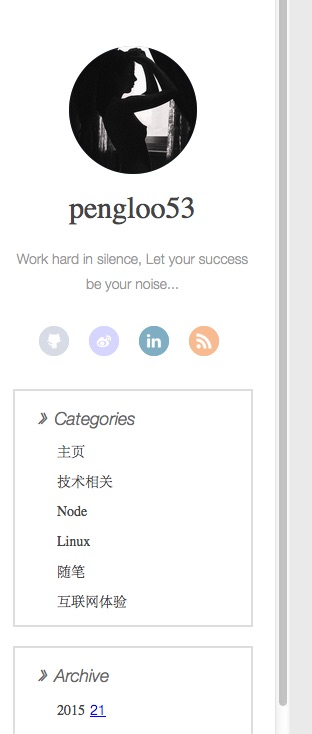

## Hexo theme
根据yilia主题自定义的一款主题，第一眼看到这个主题，就被左右两栏的设计迷住了。

然而个人口味有些不同，故针对yilia主题做了一些自定义修改。修改了以下几点：

- 添加了百度统计代码
- 去除了Mobile页面的author以及subtitle的显示（这样比较简洁好看）
- 调整2、3、4级标题的字体大小（原本没有区分）
- code标签样式改变，将代码处显示为红色字体,浅红背景
- 不显示分类（我将分类作为导航栏来显示），显示分类的话，手机端样式有些拥挤
- 去掉`.profilepic img border`解决手机端img边框Bug
- 修改左边栏样式，使其能够滚动，显示更多内容，如下图

- 修改日期显示样式

